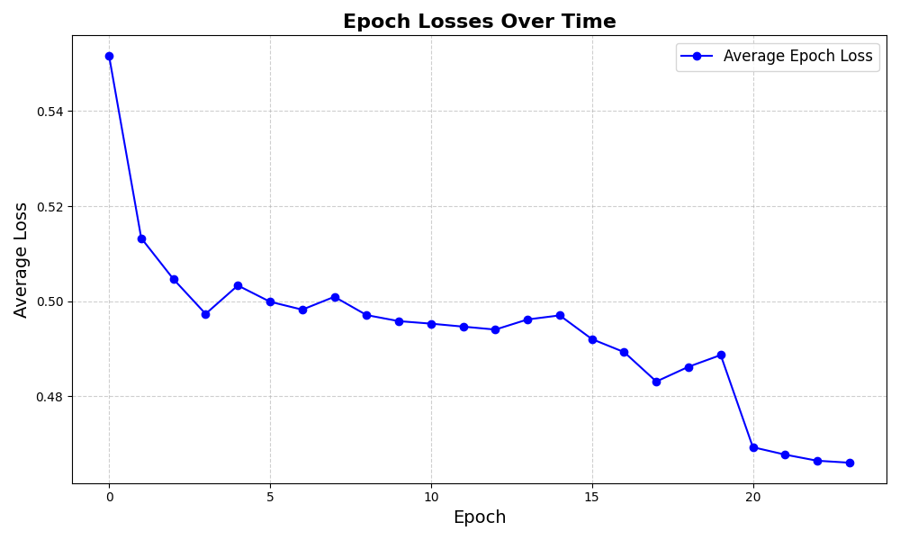
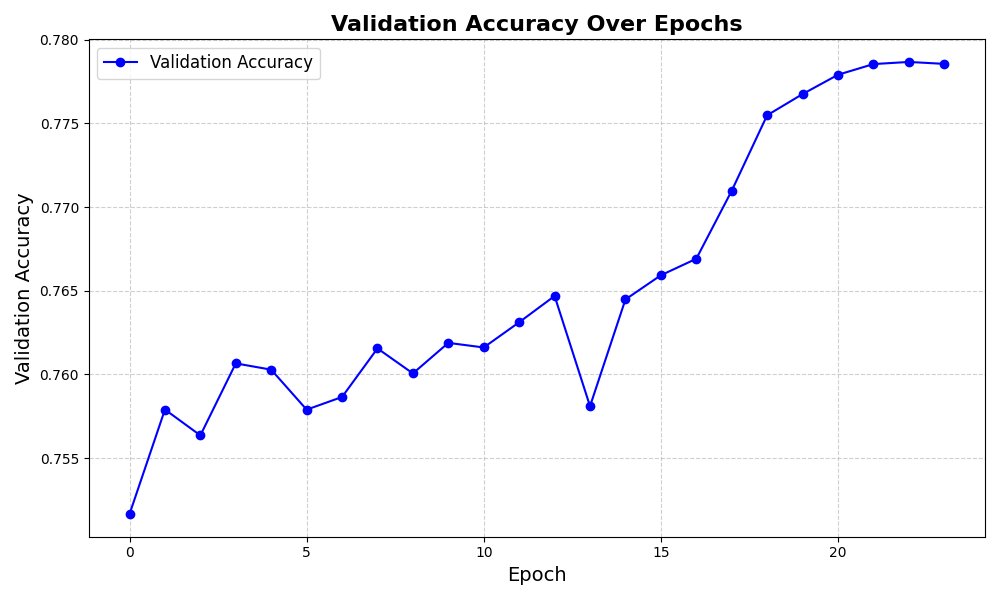

# Twitter Sentiment Analysis with CNN

A deep learning project that performs sentiment analysis on Twitter data using a Convolutional Neural Network (CNN). The system analyzes tweets to determine their emotional tone, classifying sentiments on a spectrum from very negative to very positive.

## Project Overview

This project implements a sophisticated sentiment analysis system with the following key components:

1. **CNN Architecture**: A custom CNN model designed specifically for text sentiment analysis, featuring:
   - Multiple convolutional layers with different filter sizes (3, 5, 7)
   - Batch normalization for training stability
   - Leaky ReLU activation functions
   - Dropout for regularization
   - Xavier uniform initialization

2. **Word Embeddings**: Utilizes Google's pre-trained Word2Vec model for word representations
   - 300-dimensional word vectors
   - Efficient caching system for frequently accessed embeddings

3. **Data Processing Pipeline**:
   - Tweet preprocessing and cleaning
   - Tokenization and stop word removal
   - Sequence padding and truncation
   - Efficient batch processing

4. **Training System**:
   - Mixed precision training with automatic gradient scaling
   - Early stopping mechanism
   - Learning rate scheduling
   - Gradient clipping
   - Comprehensive memory management
   - Training progress monitoring and checkpointing

## Key Features

- Real-time Twitter data analysis
- Sentiment classification into five categories (Very Negative to Very Positive)
- GPU acceleration support
- Memory-efficient processing
- Automated dataset setup
- Comprehensive system monitoring (GPU/CPU usage)
- Model checkpointing and training resumption
- Configurable hyperparameters

## Project Structure

sentiment-analysis/
├── datasets/                    # Storage for training data and embeddings
│   ├── Sentiment140v1.csv      # Twitter sentiment dataset
│   └── GoogleNews-vectors-negative300.bin  # Pre-trained word embeddings
├── models/                      # Model checkpoint storage
│   └── CNN_model.pth           # Trained model weights and states
├── parameters/                  # Training metrics and parameters
│   ├── batch_losses.json       # Per-batch loss tracking
│   ├── epoch_losses.json       # Per-epoch loss tracking
│   └── validation_accuracy.json # Model validation metrics
├── scripts/
│   ├── gpu_usage.py            # GPU memory monitoring utilities
│   │   ├── check_cuda()        # CUDA availability check
│   │   ├── print_gpu_memory()  # GPU memory usage tracking
│   │   └── list_tensors()      # Active tensor tracking
│   ├── load_data.py            # Dataset loading and processing
│   │   ├── load_sentiment140_data()  # Dataset loading
│   │   └── reduce_dataset()    # Dataset sampling
│   ├── main.py                 # Main execution script
│   │   ├── load_model()        # Model loading
│   │   └── analyze_tweets()    # Tweet sentiment analysis
│   ├── plotter.py              # Training visualization tools
│   └── train_cnn_model.py      # Model training implementation
├── sentiment_analysis/
│   ├── cnn_model.py            # CNN architecture definition
│   │   └── SentimentCNN        # Main model class
│   ├── config.py               # System configuration
│   │   └── check_files()       # Dataset verification
│   ├── early_stopping.py       # Training control mechanism
│   │   └── EarlyStopping      # Early stopping implementation
│   ├── twitter.py              # Twitter API integration
│   │   ├── fetch_tweets()      # Tweet retrieval
│   │   └── handle_rate_limit() # API rate limit handling
│   └── word_to_vector.py       # Word embedding utilities
│       ├── preprocess_tweet()  # Tweet cleaning
│       └── text_to_indices()   # Text vectorization
└── setup/
    └── setup_datasets.py       # Dataset download and setup

## Setup Instructions

### Prerequisites

- Python 3.8+
- CUDA-compatible GPU (recommended)
- Twitter API credentials
- 16GB RAM minimum (32GB recommended)
- 5GB free disk space for datasets and models

### Installation

1. Clone the repository:
```bash
git clone https://github.com/HarshadChunder/Sentiment-Analysis
cd Sentiment-Analysis
```

2. Create and activate a virtual environment:
```bash
python -m venv venv
source venv/bin/activate  # On Windows: venv\Scripts\activate
```

3. Install required packages:
```bash
pip install -r requirements.txt
```

4. Set up environment variables:
Create a `.env` file in the sentiment_analysis directory with your Twitter API credentials:
```plaintext
BEARER_TOKEN=your_twitter_bearer_token
```

5. Download required datasets:
```bash
python setup/setup_datasets.py
```

### Usage

1. Training the model:
```bash
python scripts/train_cnn_model.py
```

2. Analyzing tweets:
```bash
python scripts/main.py
```

## Implementation Details

### CNN Model Architecture

The model implements a multi-channel CNN architecture:

```plaintext
Input Text -> Word Embeddings -> Parallel Convolution Channels -> Max Pooling -> Fully Connected Layer -> Output
```

Key components:
- Input processing through 300-dimensional Word2Vec embeddings
- Three parallel convolutional channels (filter sizes: 3, 5, 7) used for local and global feature extraction
- Batch normalization after each convolution
- Leaky ReLU activation (slope=0.01)
- Dropout rate of 0.3 for regularization
- Final dense layer with sigmoid activation

### Data Processing

The system processes tweets through multiple stages:
1. **Cleaning**: Removes URLs, special characters, and numbers
2. **Tokenization**: Splits text into individual tokens
3. **Stop Word Removal**: Eliminates common words that don't carry sentiment
4. **Padding/Truncation**: Standardizes sequence length to 34 tokens
5. **Embedding**: Converts tokens to 300-dimensional vectors

### Training Process

The training implementation includes:
- Batch size of 1024 for efficient GPU utilization
- Learning rate of 0.0001 with step decay
- Early stopping with 6-epoch patience
- Mixed precision training for memory efficiency
- Gradient clipping at 2.0 to prevent exploding gradients
- Comprehensive memory management and monitoring

### Memory Management

The system implements several memory optimization techniques:
- Embedding caching for frequently used words
- Periodic CUDA cache clearing
- Batch processing with controlled memory allocation
- System memory monitoring and reporting

## Monitoring and Logging

The system provides comprehensive monitoring through:
- Real-time GPU memory usage tracking
- System memory utilization reporting
- Training progress metrics
- Validation accuracy logging
- Tensor allocation tracking

## Training Results

The following plots show the training and validation losses over each epoch during the training process.

#### Epoch Loss
This plot shows how the training loss evolved over the epochs.



#### Validation Accuracy
This plot shows how the validation accuracy changed over the epochs, with the highest recorded validation accuracy being 77.87%.



## License

This project is licensed under the Creative Commons Attribution-NonCommercial-NoDerivatives 4.0 International License - see the [LICENSE](LICENSE.md) file for details.

## Acknowledgments

- [Sentiment140 Dataset](http://help.sentiment140.com/for-students/) for providing training data
- Google's Word2Vec team for pre-trained embeddings
- Twitter API for real-time data access