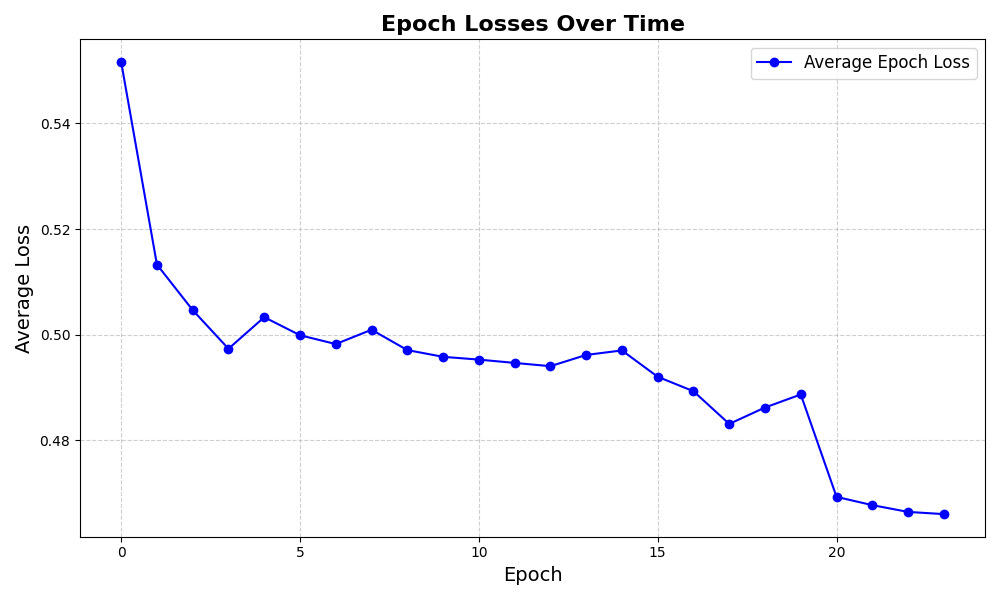

# Training Results

## Overview
This document summarizes the results of the training process, including loss plots and model performance analysis.
The following plots show the training and validation losses over each epoch during the training process.

#### Epoch Loss
This plot shows how the training loss evolved over the epochs.

#### Validation Accuracy
This plot shows how the validation accuracy changed over the epochs, with the highest recorded validation accuracy being 77.87%.

